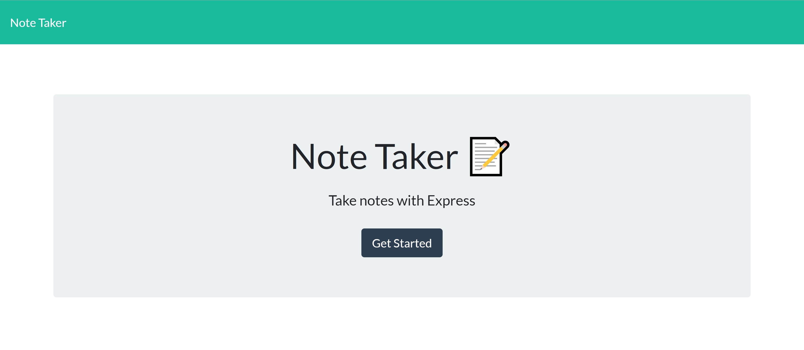
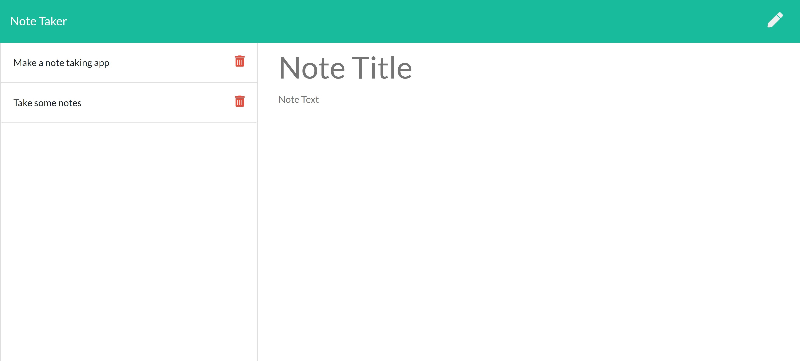

# note.taker

## Table of Contents
- [Description](#Description)
- [Usage](#Usage)
- [Screenshot](#Screenshot)
- [License](#License)
- [Language](#Language)
- [Questions](#Questions)

## Description
This is an application using express.js where the user is able to create notes and save into a JSON database. They can also delete notes they no longer need. When the user reopens the page all of the saved notes will appear so they can easily refer back to them.

## Usage
To create notes to refer to for future use.

## Screenshot

